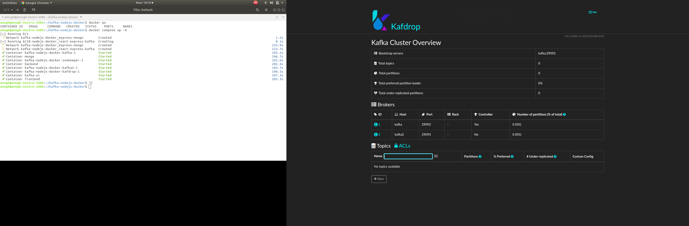
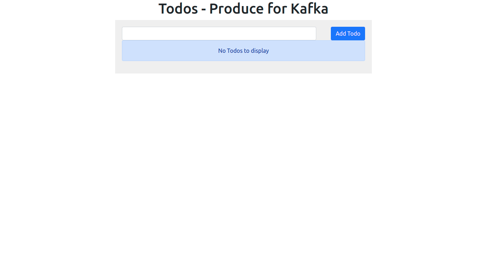

# kafka-nodejs-docker
Added by Ashish Kumar Saxena

# Folder Structure
```
.
├── backend
│   ├── config
│   │   ├── config.js
│   │   ├── config.json
│   │   └── messages.js
│   ├── consumer.js
│   ├── db
│   │   └── index.js
│   ├── logs
│   ├── models
│   │   └── todos
│   │       └── todo.js
│   ├── node_modules
│   ├── package.json
│   ├── package-lock.json
│   ├── producer.js
│   ├── routes
│   │   └── index.js
│   ├── server.js
│   └── utils
│       └── helpers
│           ├── logger.js
│           └── responses.js
├── docker-compose.yaml
├── Dockerfile
├── frontend
│   ├── node_modules
│   ├── package.json
│   ├── package-lock.json
│   ├── public
│   │   ├── favicon.ico
│   │   ├── index.html
│   │   ├── logo192.png
│   │   ├── logo512.png
│   │   ├── manifest.json
│   │   └── robots.txt
│   └── src
│       ├── App.js
│       ├── App.scss
│       ├── App.test.js
│       ├── components
│       │   ├── AddTodo.js
│       │   └── TodoList.js
│       ├── custom.scss
│       ├── index.css
│       ├── index.js
│       ├── logo.svg
│       └── serviceWorker.js
└── README.md

15 directories, 34 files
```
# Deploy with Docker on local machine
```

Please run the command at the root folder level of the project.

docker compose up -d

amogh@amogh-Vostro-3480:~/kafka-nodejs-docker$ docker ps
CONTAINER ID   IMAGE     COMMAND   CREATED   STATUS    PORTS     NAMES
amogh@amogh-Vostro-3480:~/kafka-nodejs-docker$ docker compose up -d
[+] Running 0/1
 ⠹ Network kafka-nodejs-docker_express-mongo        Created                                                                                       1.2s 
[+] Running 8/10-nodejs-docker_react-express-kafka  Creating                                                                                      0.1s 
 ⠏ Network kafka-nodejs-docker_express-mongo        Created                                                                                     224.9s  
 ⠧ Network kafka-nodejs-docker_react-express-kafka  Created                                                                                     223.7s 
 ✔ Container kafka-nodejs-docker-kafka-1            Started                                                                                     195.2s 
 ✔ Container mongo                                  Started                                                                                     196.7s 
 ✔ Container kafka-nodejs-docker-zookeeper-1        Started                                                                                     192.6s 
 ✔ Container backend                                Started                                                                                     202.4s 
 ✔ Container kafka-nodejs-docker-kafka2-1           Started                                                                                     193.7s 
 ✔ Container kafka-nodejs-docker-kafdrop-1          Started                                                                                     198.5s 
 ✔ Container kafka-ui                               Started                                                                                     197.3s 
 ✔ Container frontend                               Started                                                                                     205.3s 
```
# Kafka UI
 Go to url - http://localhost:9000

# Frontend Application 
  Go to url - http://localhost:3000


# Backend container
```
docker exec -it backend sh
npm install kafkajs

amogh@amogh-Vostro-3480:~$ cd kafka-nodejs-docker/
amogh@amogh-Vostro-3480:~/kafka-nodejs-docker$ docker exec -it backend sh
# npm install kafkajs

output: added 1 package, and audited 214 packages in 11s

```
